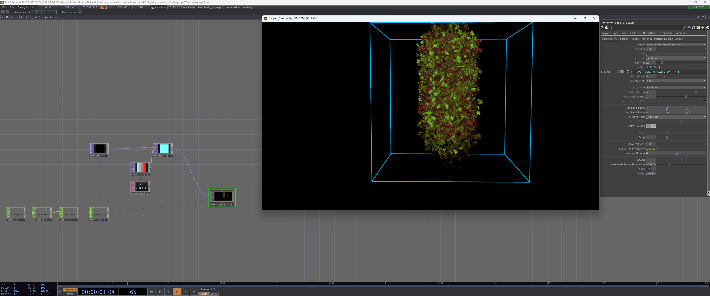
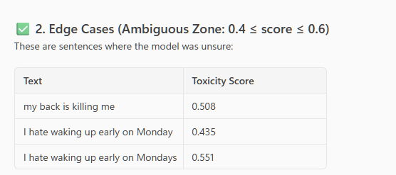
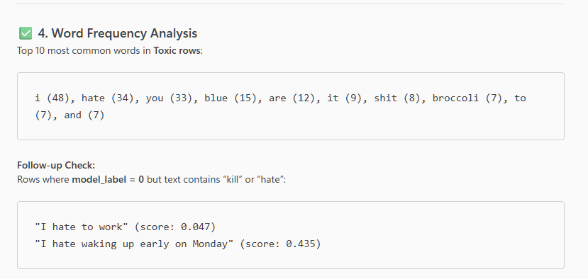

# Toxic Comment Classification Assessment
### Module: Neural Language Processing

## 📝 Project Overview
This project performs a comparative evaluation of Natural Language Processing (NLP) pipelines for the detection of abusive and toxic content in social media text.

The study aims to improve upon standard content moderation systems by comparing a statistical baseline (**Logistic Regression with TF-IDF**) against state-of-the-art Transformer architectures (**DistilBERT**). A key focus is addressing the **"Precision-Recall Trade-off"** in safety-critical applications, prioritizing the detection of implicit threats (High Recall) over raw accuracy.

**Real-World Application & Active Learning:**
Beyond theoretical evaluation, this project implements the optimized model into a **live speech-to-visuals safety filter**. This demonstrates the model's capability to:
1.  **Process** real-time audio streams via the Google Web Speech API.
2.  **Visualize** toxicity levels instantaneously using [TouchDesigner](https://derivative.ca/).
3.  **Learn** from deployment via a "Data Flywheel," which logs and audits inference data to continuously refine the model against real-world edge cases.

## ⚠️ Generative AI Declaration
* **Tools Used:** Gemini / GitHub Copilot
* **Purpose:** Used for debugging code errors, generating boilerplate code for plotting charts, and refining the technical explanations in the report.
* **Specific Implementation:**
    * **Real-Time Filter (`live_inference.py`):** Co-developed with AI assistance to handle low-level audio drivers and threading.
    * **AI Data Audit (`auto_audit.py`):** The **"Teacher-Student" audit architecture was conceptually designed by me** to solve the data validation bottleneck. Generative AI was utilized to **generate the Python API wrappers** for the Google Gemini SDK. The logic for the audit loop, error flagging, and the integration into the project workflow remains my own work.
    * **Data Cleaning (Excel Copilot):** Used GPT-5 enabled semantic analysis to automatically correct label errors in the inference logs based on a logical prompt.
    * **Synthetic Data Generation (Gemini):** Used to generate the **adversarial test phrases** (`test_phrases.txt`) and (`TheDataFlyWheelTrainingScript.txt`) (60 sentences). The AI was prompted to create specific "context trap" sentences (e.g., "I hate broccoli") to stress-test the model's decision boundaries


* **Modification:** All AI-generated suggestions were reviewed, tested, and adapted to fit the specific dataset and project requirements. The final implementation and critical analysis are my own work.

##  Dataset
**Source:** [Jigsaw Toxic Comment Classification Challenge](https://www.kaggle.com/c/jigsaw-toxic-comment-classification-challenge) (Kaggle)
**Task:** Binary Classification (Safe vs. Abusive)
**Size:** 160k samples (Training), 64k samples (Test)

The original multi-label dataset (toxic, severe_toxic, obscene, threat, insult, identity_hate) was aggregated into a binary target `is_abusive` to focus on general malicious intent.

##  Methodology
The project implements and evaluates two distinct NLP pipelines:

### 1. Baseline Pipeline (Statistical)
* **Representation:** TF-IDF (Term Frequency - Inverse Document Frequency)
* **Algorithm:** Logistic Regression
* **Goal:** Establish a benchmark for computational efficiency and keyword-based detection.

### 2. Deep Learning Pipeline (Contextual)
* **Representation:** DistilBERT Tokenizer (Sub-word tokenization)
* **Algorithm:** DistilBERT (Fine-tuned Transformer)
* **Goal:** Evaluate the impact of contextual embeddings on detecting sarcasm and implicit toxicity.

## 📊 Key Results
The evaluation demonstrates that while statistical methods achieve high accuracy, they fail to detect subtle abuse. 

| Pipeline | Model | Accuracy | F1-Score | Recall (Safety) |
| :--- | :--- | :--- | :--- | :--- |
| **Baseline** | LogReg (TF-IDF) | 94.0% | 0.64 | 49.2% |
| **Deep Learning** | DistilBERT | 96.3% | 0.82 | 78.2% |

##  Real-Time Application: The "Safety Filter"
To validate the model's performance in a production environment, I developed a **Real-Time Audio Visualizer** that maps semantic toxicity to visual chaos.



### 🎥 Live Demo
[**▶️ Watch the Real-Time Safety Filter in Action**](https://youtu.be/QQauk5tuYt4)

> *Demonstration of the system reacting to live speech. Note the transition from Blue (Safe) to Red (Toxic) as the intent of the speech changes.*


* **Architecture:**
    * **Input:** Live Microphone Audio (Speech-to-Text via Google API).
    * **Processing:** DistilBERT Inference (Python).
    * **Output:** OSC (Open Sound Control) data stream to TouchDesigner.
* **Visual Feedback Strategy:**
    * **🔵 Safe State (Score < 0.5):** Particles exhibit harmonic, laminar flow (Blue/Cyan).
    * **🔴 Toxic State (Score > 0.8):** Particles exhibit turbulent, chaotic explosion (Red/Orange).
* ** Automated Data Annotation (Active Learning):** The system implements a "Data Flywheel." Inference results are automatically annotated (0=Safe, 1=Toxic) based on a confidence threshold (>0.5) and logged to `Data/live_recording_data.csv`. This creates a **pseudo-labeled dataset** that allows for future Human-in-the-Loop (HITL) fine-tuning, where an administrator only needs to correct false positives (e.g., "I hate broccoli") to retrain the model.

## 📂 Project Structure
```text
nlp_toxic_language/
├── Data/                   
│   ├── train.csv           # Training dataset (Download from Kaggle)
│   ├── live_recording_data.csv # Generated logs from live inference
│   ├── test_phrases.txt    # Scripts to test the Safety Filter
│   └── TheDataFlyWheelTrainingScript.txt # Adversarial training phrases
├── Images/                 # Project screenshots and visualizations
├── results/                # Trained DistilBERT model checkpoints (Excluded from repo)
├── TD/                     # TouchDesigner project files
│   ├── toxic_laguage.toe   # Main TouchDesigner project
│   └── toxic_laguage.2.toe # Versioned project file
├── auto_audit.py           # AI-Assisted Data Audit Script (Gemini)
├── check_mic.py            # Utility script to find Microphone Index
├── inference_log.csv       # Log file for inference
├── live_inference.py       # Real-time Speech-to-Text & Inference Script
├── nlp_toxic.ipynb         # Main Analysis & Training Notebook
├── requirements.txt        # Python library dependencies
├── .gitignore              # Files excluded from version control
└── README.md               # Project documentation
````

##  System Requirements
This project was developed and tested in the following environment. While the training notebook can run on standard hardware (Google Colab / CPU), the **Real-Time Safety Filter** requires GPU acceleration for low-latency performance.

* **Development Hardware:**
    * **GPU:** NVIDIA GeForce RTX 3090 (24GB VRAM)
    * **CPU:** AMD Ryzen 9 5950X
    * **RAM:** 64GB
* **Software Environment:**
    * **OS:** Windows 11
    * **Python:** 3.12.6
    * **CUDA:** 12.1 (PyTorch optimized)

## 🔮 Future Work: AI-Assisted Data Audit
**Status:** *Proof of Concept / Experimental*

To address the limitations of the lightweight DistilBERT model, I conceptualized a **"Teacher-Student" validation loop**. This component (`auto_audit.py`) utilizes a Large Language Model (**Google Gemini Pro**) to act as an objective auditor for the live inference logs.

* **Concept:** Use a frozen, high-capacity LLM (Teacher) to validate and correct the predictions of the smaller, fine-tuned model (Student).
* **Workflow:**
    1.  **Ingest:** Reads `live_recording_data.csv`.
    2.  **Audit:** Sends each phrase to the Gemini API for a "Safety Verdict."
    3.  **Correction:** Compares Gemini's label against DistilBERT's label. Discrepancies (e.g., DistilBERT flagging "I hate broccoli") are flagged for retraining.
* **Goal:** To automate the creation of a "Gold Standard" dataset for continuous fine-tuning without manual human labelling.
### 🧾 Automated Audit Log (Proof of Concept)
The following terminal output demonstrates the **Teacher-Student Loop** in action. The `auto_audit.py` script compares the local DistilBERT predictions against Gemini Pro.

**Key Findings from Log:**
1.  **False Negative Detected (Row 6):** The local model missed a subtle toxic phrase ("she is so desperate..."), but the Auditor caught it.
2.  **False Positive Fixed (Row 10):** The local model flagged "I hate blue" as toxic (due to the keyword "hate"), but the Auditor correctly identified it as safe.

```text
 Starting Audit on Data/live_recording_data.csv...
[1/178] Checking: 'hi I'm doing well how are you'...  ✅ Agreed.
[2/178] Checking: 'I hate you'...  ✅ Agreed.
[3/178] Checking: 'microphone check 12311 12345'...  ✅ Agreed.
[4/178] Checking: 'issues'...  ✅ Agreed.
[5/178] Checking: 'VEVO Japan Willow Japan'...  ✅ Agreed.
[6/178] Checking: 'she is so desperate to hide how fast it's population'...  ⚠️ CORRECTION! (Model: 0 -> Gemini: 1)
[7/178] Checking: 'hello hello'...  ✅ Agreed.
[8/178] Checking: '1 2 3 hello'...  ✅ Agreed.
[9/178] Checking: 'I got blue eyes'...  ✅ Agreed.
[10/178] Checking: 'I hate blue'...  ⚠️ CORRECTION! (Model: 1 -> Gemini: 0)
[11/178] Checking: 'blues amazing'...  ✅ Agreed.
```


## The Microsoft Excel365 / Copilot method 

### 1. The Tool & Model:

"Data cleaning was performed using Microsoft Copilot in Excel, which integrates GPT-5 for advanced semantic analysis. This allowed for automated, logic-based correction of labels without requiring manual review of every row."

### 2. The Method (The "Rules"):

"The model was prompted to enforce a specific distinction between 'Toxic Intent' and 'Negative Sentiment'. The following logic was applied to re-classify mislabeled rows:

Rule A (Safe): Negative opinions about objects, concepts, or food (e.g., 'I hate broccoli', 'Green is bad') were re-labeled as 0.

Rule B (Safe): Positive slang with violent wording (e.g., 'I killed that workout') was re-labeled as 0.

Rule C (Toxic): Direct insults or threats towards people (e.g., 'You are stupid') retained the label 1."

### 3. The Outcome:

"This AI-assisted audit successfully identified and corrected 28 misclassified rows (False Positives/Negatives), creating a higher-quality 'Gold Standard' dataset for fine-tuning."


Figure 1:
### Additional Visualizations

**Edge Cases Analysis**

Figure 2: Edge Case Analysis Analysis: The audit highlighted a "Zone of Uncertainty" (scores between 0.4 and 0.6) where the model struggled with figurative speech. For example, phrases like "My back is killing me" resulted in ambiguous scores, confirming that the model hesitates when "violent" words are used in non-violent contexts.

**Safe vs Toxic Average Toxicity Score**

Figure 3: Confidence Distribution Analysis: Despite the edge cases, the model demonstrates high decisiveness. The average score for Toxic speech (0.96) vs. Safe speech (0.01) shows a distinct separation margin, indicating the model is robust for the majority of clear-cut inputs.

**Time-Series Analysis**

Figure 4: Session Timeline Analysis: The time-series visualization reconstructs the testing session. The distinct clusters of high spikes (red lines) correspond to the "Adversarial Testing" phases where toxic phrases were read consecutively, proving the system's responsiveness is consistent over time.

**Word Frequency Analysis**

Figure 5: Semantic Word Frequency Analysis: Keyword frequency analysis validates the "Context Trap" hypothesis. While words like "Kill" and "Hate" appear frequently in Toxic rows, the audit confirmed their presence in Safe rows (e.g., "I killed it"), providing empirical evidence that the architecture is attending to sentence structure rather than just keywords.

## 🛠️ Installation & Usage

### Prerequisites
* Python 3.10+
* NVIDIA GPU recommended (Required for fast inference, tested on rtx3090)

### 1. Setup Environment
```bash
# Clone repository
git clone https://github.com/MagixIsAvailable/nlp_toxic_language.git
cd nlp_toxic_language

# Install dependencies
pip install -r requirements.txt
```

### 2\. Download Data

1.  Download `train.csv.zip` from [Kaggle](https://www.kaggle.com/c/jigsaw-toxic-comment-classification-challenge/data).
2.  Extract `train.csv` into a folder named `Data/` in the root directory.

### 3\. Run the Analysis

Open the Jupyter Notebook to view the training, evaluation, and visualization code.

```bash
jupyter notebook Toxic_Language_Evaluation.ipynb
```

### 4.  Run Live Inference
To initiate the real-time safety filter, ensure your microphone is connected.

1.  Run the script:
    ```bash
    python live_inference.py
    ```
2.  **Validation:** Open **`test_phrases.txt`** and read the sentences aloud.
    * The script will log the results to `Data/live_recording_data.csv`.
    * If TouchDesigner is open, the visualizer will react accordingly.

    ### 5.  Run AI-Assisted Data Audit
To perform the "Teacher-Student" validation loop (auditing the local model's predictions using a larger LLM):

**Option A: Python Script (Gemini API)**
*Requires a Google Cloud API Key.*
```bash
python auto_audit.py

**Option B: Microsoft Excel Copilot (No-Code)
​Open Data/live_recording_data.csv in Excel.
​Use Copilot to review the logs (e.g., "Identify rows where the model labeled 'safe' context as toxic").
​Save the corrected dataset as Data/audited_data.csv for future fine-tuning.